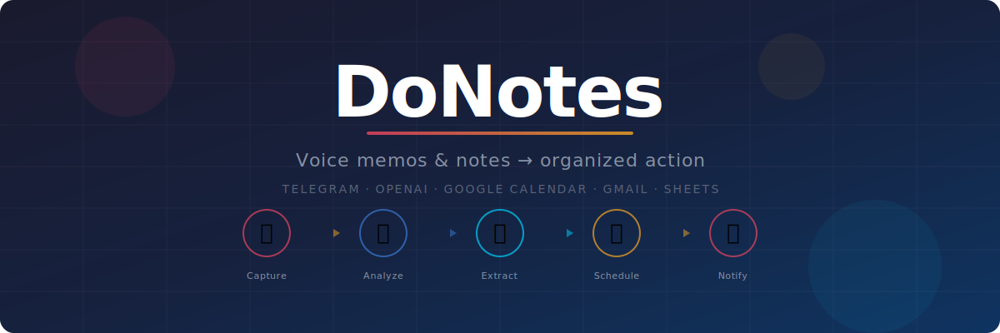

<p align="center">
  
</p>

<p align="center">
  <strong>AI-powered personal productivity bot that turns voice notes and conversations into organized action.</strong>
</p>

<p align="center">
  Send a voice memo, audio recording, or text note via Telegram — DoNotes transcribes it, extracts action items and calendar events, creates Google Calendar entries, logs everything to Sheets, and sends email digests. All automatically.
</p>

---

## Features

- **Voice & Text Capture** — Send voice memos, audio files, or text notes via Telegram
- **AI Transcription** — Automatic speech-to-text via OpenAI Whisper API
- **Smart Extraction** — GPT analyzes your messages to extract:
  - Action items with deadlines and priorities
  - Calendar events with times, locations, and attendees
  - Commitments (who promised what to whom)
  - People mentioned with roles and context
  - Work vs personal classification
  - Urgency scoring (1-10)
- **Google Calendar** — Auto-creates color-coded events on your work/personal calendars
- **Google Sheets** — Maintains a color-coded tracker spreadsheet with all extracted data
- **Email Digests** — Sends rich HTML digest emails for every processed message
- **Email Composition** — Suggests and auto-composes contextual emails to people mentioned
- **Inline Actions** — Mark action items as done/ignored directly from Telegram buttons
- **Duplicate Detection** — Fuzzy matching prevents duplicate action items
- **Contact Book** — Builds a people graph with roles, relationships, and email addresses
- **macOS Menu Bar App** — Optional native widget to start/stop the bot (macOS only)

## Quick Start

Already familiar with Telegram bots, OpenAI, and Google Cloud? Here's the short version:

```bash
git clone https://github.com/NikhiljVIbe/DoNotes.git && cd DoNotes
python3 -m venv .venv && source .venv/bin/activate
pip install -e .
cp .env.example .env              # Fill in your API keys
python scripts/setup_google_oauth.py  # Authorize Google access
python __main__.py                # Start the bot
```

New to any of these? Follow the detailed guide below.

---

## Detailed Installation Guide

### Prerequisites

| Requirement | What it is | Where to get it |
|-------------|-----------|-----------------|
| **Python 3.9+** | Programming language runtime | [python.org/downloads](https://www.python.org/downloads/) |
| **Telegram account** | Messaging app where you'll interact with the bot | [telegram.org](https://telegram.org/) |
| **OpenAI API key** | Powers transcription (Whisper) and analysis (GPT) | [platform.openai.com](https://platform.openai.com/api-keys) |
| **Google Cloud project** | Enables Gmail, Calendar, and Sheets integration | [console.cloud.google.com](https://console.cloud.google.com/) |

---

### Step 1: Clone & Install

```bash
# Download the code
git clone https://github.com/NikhiljVIbe/DoNotes.git
cd DoNotes

# Create an isolated Python environment
python3 -m venv .venv
source .venv/bin/activate  # On Windows: .venv\Scripts\activate

# Install DoNotes and all dependencies
pip install -e .
```

> **Why `pip install -e .`?** This installs the project in "editable" mode, so all the internal imports work correctly. It reads dependencies from `pyproject.toml`.

---

### Step 2: Create a Telegram Bot

You need a Telegram bot that you'll message. BotFather creates it for you.

1. Open Telegram and search for **@BotFather** (or tap [this link](https://t.me/BotFather))
2. Send `/newbot`
3. Choose a **name** (display name, e.g., "My DoNotes") and a **username** (must end in `bot`, e.g., `my_donotes_bot`)
4. BotFather replies with your **bot token** — it looks like:
   ```
   123456789:ABCdefGHIjklMNOpqrsTUVwxyz
   ```
   Save this token. You'll need it in Step 5.

5. **Find your Telegram user ID** — message **@userinfobot** ([link](https://t.me/userinfobot)) and it replies with your numeric user ID (e.g., `987654321`). This restricts the bot so only you can use it.

---

### Step 3: Get an OpenAI API Key

DoNotes uses OpenAI for two things: **Whisper** (voice-to-text) and **GPT-4o** (smart extraction).

1. Go to [platform.openai.com/api-keys](https://platform.openai.com/api-keys)
2. Click **"Create new secret key"**
3. Copy the key (starts with `sk-`)
4. Make sure you have billing set up — go to [platform.openai.com/settings/organization/billing](https://platform.openai.com/settings/organization/billing) to add credits

> **Cost:** Typical usage is very low. A voice note costs ~$0.01-0.05 (Whisper) + ~$0.01-0.03 (GPT-4o).

---

### Step 4: Set Up Google Cloud

This is the longest step, but you only do it once. DoNotes needs access to three Google services: **Gmail** (to send digest emails), **Google Calendar** (to create events), and **Google Sheets** (to maintain a tracker).

#### 4a. Create a Google Cloud Project

1. Go to [console.cloud.google.com](https://console.cloud.google.com/)
2. Click the project dropdown at the top (next to "Google Cloud") > **"New Project"**
3. Name it anything (e.g., `donotes`) and click **Create**
4. Make sure the new project is selected in the dropdown

#### 4b. Enable the Three APIs

In your project, go to **APIs & Services > Library** (left sidebar), then search for and enable each:

1. **Gmail API** — Search "Gmail API", click it, click **Enable**
2. **Google Calendar API** — Search "Google Calendar API", click it, click **Enable**
3. **Google Sheets API** — Search "Google Sheets API", click it, click **Enable**

#### 4c. Configure the OAuth Consent Screen

Before creating credentials, Google requires a consent screen:

1. Go to **APIs & Services > OAuth consent screen** (left sidebar)
2. Choose **External** and click **Create**
3. Fill in the required fields:
   - **App name:** `DoNotes`
   - **User support email:** Your email
   - **Developer contact:** Your email
4. Click **Save and Continue** through the remaining steps (Scopes, Test Users)
5. On the **Test Users** page, click **"Add Users"** and add your own Gmail address
6. Click **Save and Continue**, then **Back to Dashboard**

> **Why "External" and "Test Users"?** Since only you will use this app, External + Test User is the simplest setup. The tradeoff: tokens expire every 7 days and you'll need to re-run the auth script. To avoid this, you can later click **"Publish App"** on the consent screen (no review needed for personal use).

#### 4d. Create OAuth Credentials

1. Go to **APIs & Services > Credentials** (left sidebar)
2. Click **"+ Create Credentials"** > **"OAuth client ID"**
3. Application type: **Desktop app**
4. Name: `DoNotes` (or anything)
5. Click **Create**
6. Click **"Download JSON"** on the popup (or find it in the credentials list and click the download icon)

#### 4e. Place Credentials & Authorize

```bash
# Create the directory for Google tokens
mkdir -p data/google_tokens

# Move the downloaded file (adjust the filename to match yours)
mv ~/Downloads/client_secret_*.json data/google_tokens/credentials.json

# Run the authorization script
python scripts/setup_google_oauth.py
```

This opens your browser. Sign in with your Google account and click **"Allow"** for Gmail, Calendar, and Sheets. The token is saved locally in `data/google_tokens/token.json`.

> **"This app isn't verified" warning:** This is normal for personal projects. Click **"Advanced"** > **"Go to DoNotes (unsafe)"** to proceed. It's your own app — there's no risk.

---

### Step 5: Configure Environment Variables

```bash
cp .env.example .env
```

Open `.env` in your editor and fill in your values:

#### Required Variables

| Variable | What to put | Example |
|----------|------------|---------|
| `DONOTES_TELEGRAM_BOT_TOKEN` | Bot token from Step 2 | `123456789:ABCdef...` |
| `DONOTES_TELEGRAM_ALLOWED_USER_IDS` | Your user ID from Step 2 (in brackets) | `[987654321]` |
| `DONOTES_OPENAI_API_KEY` | API key from Step 3 | `sk-proj-...` |
| `DONOTES_GMAIL_SENDER_EMAIL` | Your Gmail address | `you@gmail.com` |
| `DONOTES_GMAIL_RECIPIENT_EMAIL` | Where digests go (usually same) | `you@gmail.com` |
| `DONOTES_WORK_CALENDAR_ID` | Work calendar (your work email) | `you@company.com` |
| `DONOTES_PERSONAL_CALENDAR_ID` | Personal calendar (your Gmail) | `you@gmail.com` |
| `DONOTES_TIMEZONE` | Your [IANA timezone](https://en.wikipedia.org/wiki/List_of_tz_database_time_zones) | `America/New_York` |
| `DONOTES_USER_NAME` | Your name (used in AI prompts) | `John` |

#### Optional Variables (defaults are fine)

| Variable | Default | Description |
|----------|---------|-------------|
| `DONOTES_OPENAI_MODEL` | `gpt-4o` | GPT model for extraction |
| `DONOTES_WHISPER_MODEL` | `distil-large-v3` | Whisper model for transcription |
| `DONOTES_GOOGLE_SHEET_ID` | *(auto-created)* | Google Sheet ID — auto-populated on first run |
| `DONOTES_MORNING_BRIEF_HOUR` | `8` | Hour for daily morning brief email |

---

### Step 6: Personalize AI Context (Optional but Recommended)

This step teaches the AI about your world — your team, family, places, companies. It dramatically improves accuracy.

```bash
cp config/user_profile.example.py config/user_profile.py
```

Edit `config/user_profile.py` with your details. This helps the AI:
- Correctly classify **work vs personal** messages (e.g., knowing "Sarah" is your manager)
- **Recognize names** accurately during transcription
- Avoid suggesting emails **to yourself**
- Identify **places and companies** you frequently mention

> This file is gitignored — your personal data stays on your machine only.

---

### Step 7: Run the Bot

```bash
python __main__.py
```

You should see:
```
INFO - DoNotes bot starting...
INFO - Bot is running. Send a voice note or text message on Telegram!
```

Open Telegram, find your bot, and send a voice note or text message!

---

## Optional: macOS Menu Bar App

A native macOS menu bar widget to start/stop the bot with a click:

```bash
pip install -e ".[menubar]"
python -m menubar
```

To build as a standalone `.app`:

```bash
python setup_menubar.py py2app
# The app will be in dist/DoNotes.app
```

## Optional: Auto-Start on macOS (launchd)

Start the bot automatically when you log in:

```bash
cd launchd
bash install.sh
```

---

## Project Structure

```
DoNotes/
├── __main__.py              # Bot entry point
├── config/
│   ├── settings.py          # Environment variable configuration
│   ├── prompts.py           # GPT system prompts
│   ├── vocabulary.py        # Whisper vocabulary hints
│   ├── calendars.py         # Calendar ID routing (work vs personal)
│   └── user_profile.example.py  # AI personalization template
├── src/
│   ├── bot/                 # Telegram bot (handlers, callbacks, email flow)
│   ├── ai/                  # OpenAI client, extraction, email composition
│   ├── integrations/        # Gmail, Google Calendar, Sheets, OAuth
│   ├── storage/             # SQLite database, repositories, migrations
│   ├── transcription/       # Whisper API pipeline
│   └── core/                # Message processor, dedup, email suggestions
├── menubar/                 # macOS menu bar app (optional)
├── scripts/                 # Setup scripts (Google OAuth)
├── launchd/                 # macOS auto-start configuration
└── tests/                   # Test suite
```

## How It Works

1. You send a voice note or text to the Telegram bot
2. Audio is transcribed using OpenAI Whisper
3. GPT analyzes the transcript and extracts structured data
4. Results are stored in SQLite and sent back to you on Telegram
5. Calendar events are created in Google Calendar (color-coded by type)
6. A row is appended to your Google Sheets tracker
7. An HTML digest email is sent to your inbox
8. The bot suggests emailing people mentioned, with auto-composed drafts

## Troubleshooting

| Problem | Cause | Fix |
|---------|-------|-----|
| Bot doesn't respond to messages | User ID mismatch | Check `DONOTES_TELEGRAM_ALLOWED_USER_IDS` matches your ID from @userinfobot |
| `RefreshError` or Google auth errors | OAuth token expired (7-day limit in Testing mode) | Re-run `python scripts/setup_google_oauth.py` |
| `HttpError 403` on Google APIs | API not enabled in Cloud Console | Go to APIs & Services > Library and enable the missing API |
| `HttpError 404` on calendar | Wrong calendar ID | Verify `DONOTES_WORK_CALENDAR_ID` and `DONOTES_PERSONAL_CALENDAR_ID` are correct email addresses |
| Transcription errors / wrong names | Whisper doesn't know your vocabulary | Add names and places to `config/user_profile.py` |
| `ModuleNotFoundError` | Dependencies not installed | Run `pip install -e .` in your virtual environment |

## Tech Stack

- **Python 3.9+** with fully async architecture
- **python-telegram-bot** — Telegram bot framework
- **OpenAI** — Whisper (transcription) + GPT-4o (extraction & composition)
- **Google APIs** — Gmail, Calendar, Sheets
- **SQLite** (aiosqlite) — Local database with migration support
- **Pydantic** — Configuration and data validation
- **Jinja2** — HTML email templates

## License

MIT License. See [LICENSE](LICENSE) for details.
